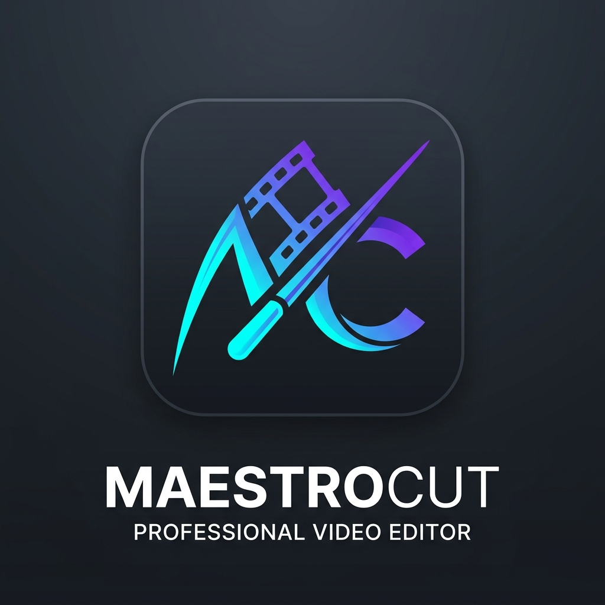
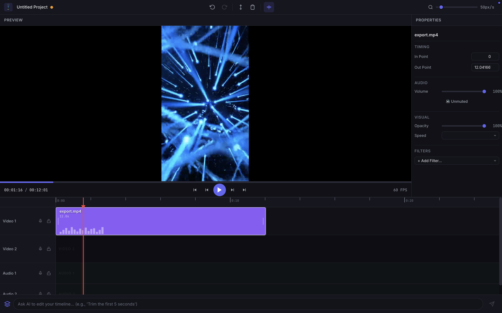

# MaestroCut

<p align="center">
  
</p>

A Desktop Non-Linear Video Editor with an integrated AI Copilot. Built with **Angular 21**, **Electron 41**, **FFmpeg**, and the **Vercel AI SDK**.

<p align="center">
  
</p>

Users can manually trim, filter, and edit videos via a drag-and-drop timeline, or use the interactive AI chat prompt to manipulate the timeline via natural language (e.g., *"Trim the first 5 seconds and mute the audio"*).

> **Design philosophy**: The UI "fakes" all edits during preview using HTML5 video manipulation (CSS filters, `currentTime` seeking). Actual video rendering is deferred to FFmpeg, which only runs when the user clicks **Export**.

---

## Table of Contents

- [Prerequisites](#prerequisites)
- [Installation](#installation)
- [Configuration](#configuration)
- [Development](#development)
- [Production Build](#production-build)
- [Packaging for Distribution](#packaging-for-distribution)
- [Docker Build](#docker-build)
- [Project Structure](#project-structure)
- [Keyboard Shortcuts](#keyboard-shortcuts)
- [AI Copilot Usage](#ai-copilot-usage)
- [Troubleshooting](#troubleshooting)

---

## Prerequisites

Make sure you have the following installed on your system:

| Tool | Version | Check | Install |
|---|---|---|---|
| **Node.js** | 22+ (LTS) | `node -v` | [nodejs.org](https://nodejs.org) |
| **npm** | 10+ | `npm -v` | Comes with Node.js |
| **FFmpeg** | 6+ | `ffmpeg -version` | See below |
| **Git** | Any | `git --version` | [git-scm.com](https://git-scm.com) |

### Installing FFmpeg

**macOS** (Homebrew):
```bash
brew install ffmpeg
```

**Ubuntu/Debian**:
```bash
sudo apt update && sudo apt install -y ffmpeg
```

**Windows** (Chocolatey):
```bash
choco install ffmpeg
```

**Windows** (Manual): Download from [ffmpeg.org/download](https://ffmpeg.org/download.html) and add to `PATH`.

Verify installation:
```bash
ffmpeg -version
ffprobe -version
```

---

## Installation

1. **Clone the repository**:
   ```bash
   git clone <repository-url>
   cd video-editor
   ```

2. **Install dependencies**:
   ```bash
   npm install
   ```
   > This installs both Angular and Electron dependencies in one step.

---

## Configuration

1. **Copy the environment template**:
   ```bash
   cp .env.example .env
   ```

2. **Edit `.env`** and set your Gemini API key:
   ```env
   # Get a free key at https://aistudio.google.com/apikey
   GEMINI_API_KEY=your_actual_api_key_here

   # Model to use (default: gemini-2.5-flash)
   GEMINI_MODEL=gemini-2.5-flash

   # Auto-save interval in ms (default: 60000 = 1 minute)
   AUTOSAVE_INTERVAL=60000
   ```

> **Note**: The AI Copilot is optional. The editor works fully without an API key — the AI prompt bar will simply return a message asking you to configure it.

---

## Development

### Option 1: Angular only (browser preview)

For fast UI iteration without Electron:

```bash
npm start
```

This starts the Angular dev server at **http://localhost:4200**. Hot-reload is enabled. File dialogs and FFmpeg features won't work, but the UI, timeline, and state management are fully functional.

### Option 2: Full Electron development

Launches Angular dev server + Electron window simultaneously:

```bash
npm run dev
```

This uses `concurrently` to:
1. Start `ng serve` on port 4200
2. Wait for the server to be ready
3. Launch `electron .` which loads `http://localhost:4200`

> **Tip**: DevTools open automatically in dev mode. Press `Cmd+Shift+I` / `Ctrl+Shift+I` to toggle them.

### Option 3: Start Electron with an existing dev server

If you already have Angular running, start Electron separately:

```bash
# Terminal 1 — Angular
npm start

# Terminal 2 — Electron
npm run start:electron
```

---

## Production Build

### Build Angular for production

```bash
npm run build
```

Output: `dist/renderer/browser/`

This compiles the Angular app with:
- Ahead-of-Time (AOT) compilation
- Tree shaking & dead-code elimination
- `baseHref: './'` for Electron file:// loading
- Production-mode optimizations

### Test the production build in Electron

```bash
npm run build
npm run start:electron
```

Electron detects `app.isPackaged` and loads from `dist/renderer/browser/index.html` instead of the dev server.

---

## Packaging for Distribution

Create platform-specific installers using `electron-builder`:

```bash
# macOS (.dmg + .zip)
npm run dist:mac

# Windows (.exe installer + portable)
npm run dist:win

# Linux (.AppImage + .deb)
npm run dist:linux

# Current platform
npm run dist
```

Output: `release/` directory.

### Build matrix

| Platform | Formats | Command |
|---|---|---|
| macOS | `.dmg`, `.zip` | `npm run dist:mac` |
| Windows | `.exe` (NSIS), Portable | `npm run dist:win` |
| Linux | `.AppImage`, `.deb` | `npm run dist:linux` |

> **Cross-compilation**: Building for other platforms requires platform-specific tools. It's recommended to build on the target OS or use CI/CD.

---

## Docker Build

Build the project in a Docker container (useful for CI/CD):

```bash
# Build the Docker image and extract artifacts
docker compose -f docker-compose.yml build
docker compose -f docker-compose.yml run --rm builder
```

Artifacts are copied to `./build-output/`:
- `renderer/` — Built Angular app
- `electron/` — Main process JS files
- `release/` — Electron distributables (Linux)

### Manual Docker build

```bash
docker build -f Dockerfile.build -t nle-builder .
docker run --rm -v $(pwd)/build-output:/output nle-builder \
  sh -c "cp -r /artifacts/* /output/"
```

---

## Project Structure

```
video-editor/
├── electron/                  # Electron main process (Node.js)
│   ├── main.js                # Window, menu, IPC handlers
│   ├── preload.js             # Secure IPC bridge (contextBridge)
│   ├── ffmpeg-engine.js       # Export pipeline (trim → concat → encode)
│   ├── filter-builder.js      # NLE filters → FFmpeg filtergraph
│   ├── input-sanitizer.js     # Security: validates all FFmpeg inputs
│   └── gemini-proxy.js        # Vercel AI SDK wrapper with Zod schema
│
├── src/
│   ├── app/
│   │   ├── core/
│   │   │   ├── commands/      # Command Pattern (8 command files)
│   │   │   ├── models/        # TypeScript interfaces (Clip, Track, ProjectState)
│   │   │   └── services/      # Angular services (state, playback, shortcuts, AI)
│   │   ├── features/
│   │   │   ├── editor/        # Root editor layout (CSS Grid shell)
│   │   │   ├── preview/       # Video preview with CSS filter pipeline
│   │   │   ├── timeline/      # Timeline with ruler, clips, playhead
│   │   │   ├── toolbar/       # Toolbar with edit actions
│   │   │   ├── properties/    # Clip property inspector
│   │   │   ├── export/        # Export dialog with progress ring
│   │   │   └── ai-copilot/    # AI prompt bar
│   │   └── shared/
│   │       └── pipes/         # TimeFormat, FileSize pipes
│   ├── styles.css             # Global design system (60+ CSS tokens)
│   ├── index.html
│   └── main.ts                # Angular bootstrap
│
├── .env                       # Environment config (GEMINI_API_KEY)
├── .env.example               # Template for .env
├── angular.json               # Angular build config
├── package.json               # Dependencies + Electron builder config
├── tsconfig.json              # TypeScript config
├── Dockerfile.build           # Multi-stage Docker build
├── docker-compose.yml         # Docker compose for CI
└── .dockerignore
```

---

## Keyboard Shortcuts

### Playback
| Key | Action |
|---|---|
| `Space` / `K` | Play / Pause |
| `J` | Skip back 5 seconds |
| `L` | Skip forward 5 seconds |
| `←` | Previous frame |
| `→` | Next frame |
| `Home` | Jump to start |
| `End` | Jump to end |

### Editing
| Key | Action |
|---|---|
| `S` | Split at playhead |
| `Delete` / `Backspace` | Delete selected clips |
| `Ctrl+Z` / `⌘+Z` | Undo |
| `Ctrl+Shift+Z` / `⌘+Shift+Z` | Redo |

### Timeline
| Key | Action |
|---|---|
| `N` | Toggle snap |
| `+` / `=` | Zoom in |
| `-` | Zoom out |
| `0` | Reset zoom |

### Selection
| Key | Action |
|---|---|
| `Ctrl+A` / `⌘+A` | Select all clips |
| `Escape` | Deselect all |

---

## AI Copilot Usage

The AI prompt bar at the bottom of the editor accepts natural language commands:

### Example prompts
| Prompt | What it does |
|---|---|
| *"Trim the first 5 seconds"* | Sets `inPoint = 5` on the first clip |
| *"Mute all clips"* | Applies mute to every clip |
| *"Apply a sepia filter"* | Adds a sepia filter to the selected clip |
| *"Speed up to 2x"* | Sets playback rate to 2.0 |
| *"Add a blur with radius 3"* | Applies a blur filter with radius 3px |
| *"Delete the last clip"* | Removes the clip with the highest startTime |
| *"Set volume to 50%"* | Sets volume to 0.5 |

### How it works
1. Your prompt + current timeline state (clips, tracks, filters) are sent to the Vercel AI SDK running on the backend.
2. The SDK routes the request to Google Gemini with a strict **Zod** schema.
3. It returns perfectly structured JSON commands, parsing out hallucinations.
4. Commands execute as a single **undoable batch** (Ctrl+Z to revert).
5. The UI automatically highlights the affected clips and displays an interactive confirmation card mapping the actions taken.

> The API key stays in the Electron main process and never reaches the browser renderer.

---

## Troubleshooting

### `FFmpeg not found`
Make sure `ffmpeg` and `ffprobe` are in your system `PATH`:
```bash
which ffmpeg    # macOS/Linux
where ffmpeg    # Windows
```

### `GEMINI_API_KEY is not configured`
Copy `.env.example` to `.env` and set your key:
```bash
cp .env.example .env
# Edit .env and add your key
```

### `Electron shows blank screen`
The Angular dev server may not be running. Start it first:
```bash
npm start
# Then in another terminal:
npm run start:electron
```
Or use `npm run dev` to start both together.

### `Port 4200 already in use`
Another process is using the port. Kill it or use a different port:
```bash
# Find what's using port 4200
lsof -i :4200

# Or start on a different port
npx ng serve --port 4201
```

### Build fails with `Node.js version detected` warning
The project supports Node.js 22 LTS. Odd-numbered versions (23, 25) work but show a warning. This is safe to ignore.

### `electron-builder` fails on first run
Some native modules need rebuilding:
```bash
npx electron-rebuild
npm run dist
```

---

## License

This project is distributed under the MIT License. See the `LICENSE` file for details.

Copyright (c) 2026 Hosam.
